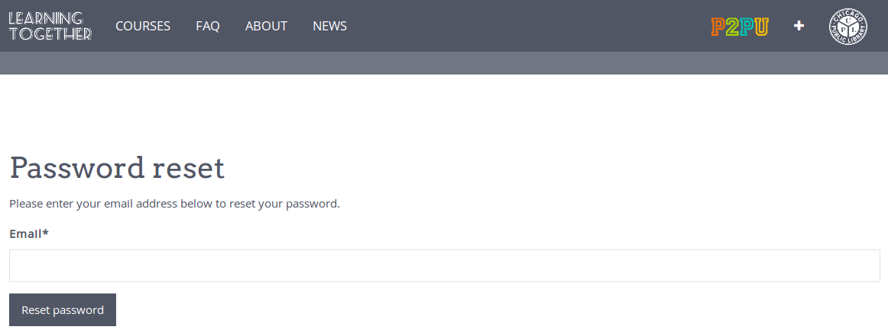
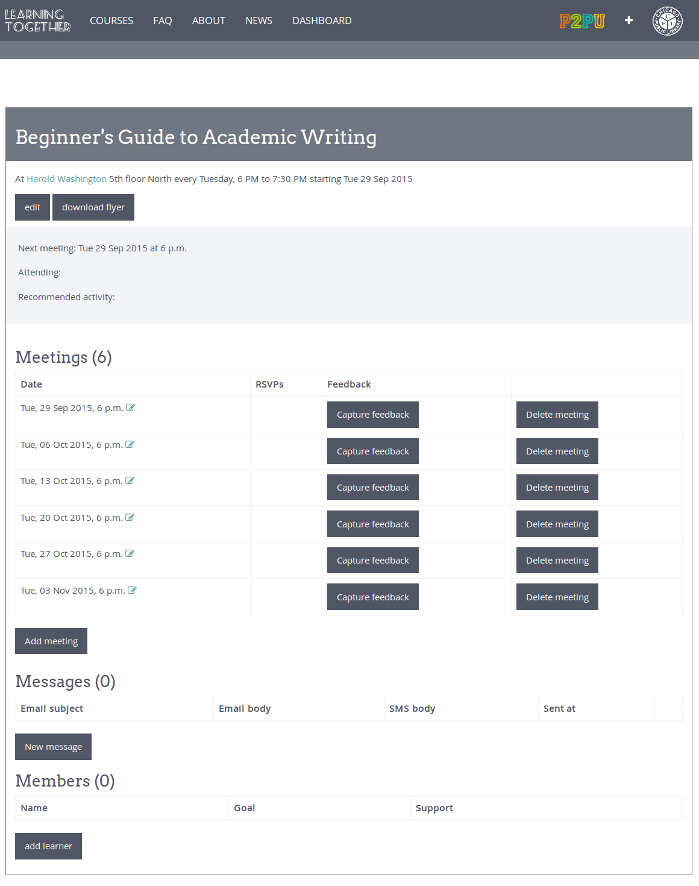
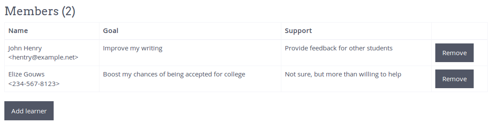
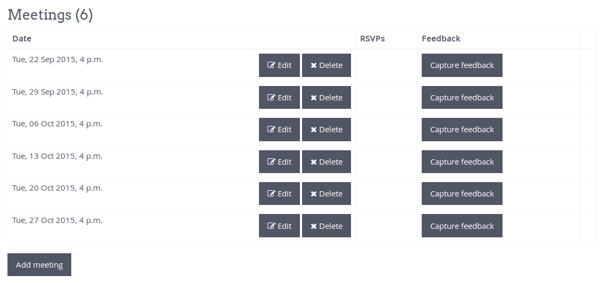
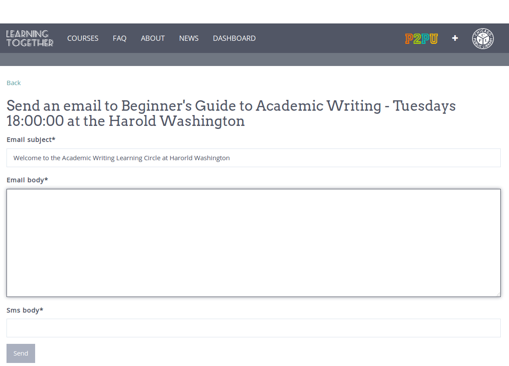
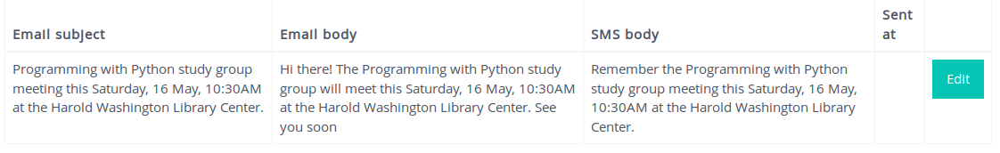
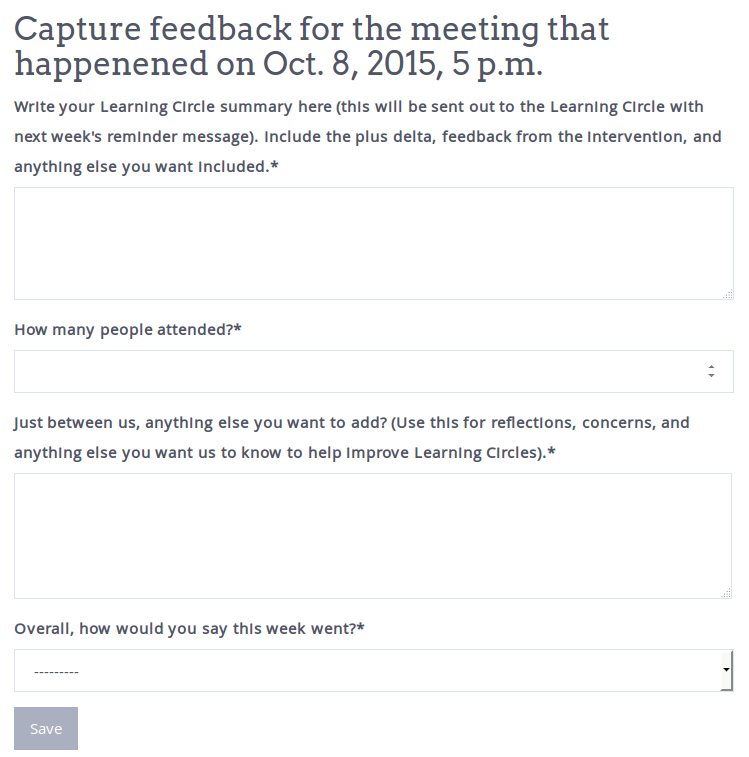

Facilitator dashboard guide
===========================

Before you can log into your dashboard, you need to contact your learning circle organizer and ask them to create an account for you. Once you've done so, you need to obtain your password. You can do so by going to: http://example.com/accounts/password_reset/ and resetting your password. You will receive an email with instructions on setting your new password.

Log In
------

After setting your password you will be logged in and redirected to the dashboard. You can also access your dashboard directly at http://example.com/facilitator/. Whenever you log in, this is the page that you’ll see.

Collect and Manage Signups
--------------------------

Learners can sign up for Learning Circles on http://example.com and we recommend that you ensure all learners are signed up during the first meeting. If you need to add or remove learners from the Learning Circle, you can do so on the “Members” part of the dashboard.

To add a learner manually, click the “Add learner” button and fill in the learner detail. You will need to fill in the “Goal” and “Support” fields, so make sure that you get this information from the learners if you plan to add them to the dashboard at a later stage.

View and Edit Meeting Times
---------------------------

The dashboard will show you a list of all the meetings that are scheduled for you Learning Circle. Students have the opportunity to RSVP to meeting reminders via emails they receive, and as they RSVP you will be able to see their responses here. If there are some meetings that will happen at a different time than normal, or if you would like to add an extra meeting, you can do so here.

Contact Learners
----------------
To send a new message to all learners, you can click on “New message”.

.. image:: _static/facilitator-dash-messages.png

Here you can author a message that will be sent out to everyone who signed up for the Learning Circle. The text you put in the “Email body” field will be sent to the learners who signed up with an email address, while the text in the “SMS body” field will be sent to the those who signed up with a mobile number. SMS text should be short (limited to 160 characters).

Automatic reminders will be generated for Learning Circle meetings 4 days ahead of the meeting time. When this reminder is generated you will receive an email with an example of the reminder. If you wish to edit the content of the reminder, you can follow the link in this reminder or you can go to the dashboard and edit the reminder from there.

The reminder will be sent to Learning Circle participants 2 days before the meeting time. If you do not want to make any changes to the meeting reminder, you can simply ignore the reminder.

Capture Feedback
----------------

Each week ends with a short intervention where the facilitator should capture feedback from the Learning Circles. The facilitator can capture this information in any way that they want, but at some point (during or right after the Learning Circle, the facilitators should record this information in the dashboard by clicking on the “Capture Feedback” button next to the appropriate meeting date.

Support
-------

If you have any questions, encounter any problems or need to do something that is not addressed above, you can contact us on our `forum <https://community.p2pu.org>`_. 

