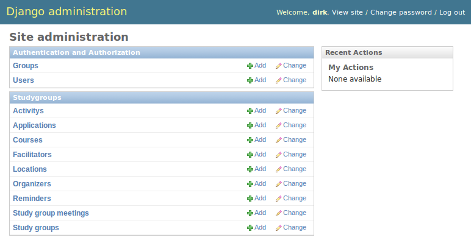
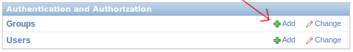
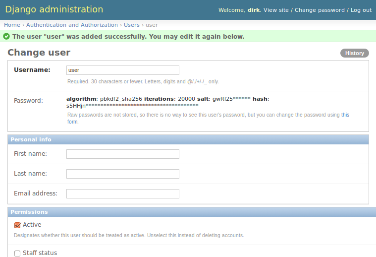
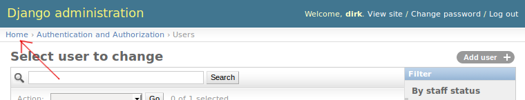
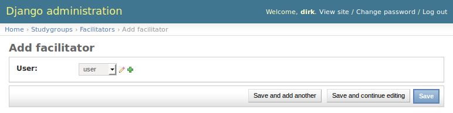
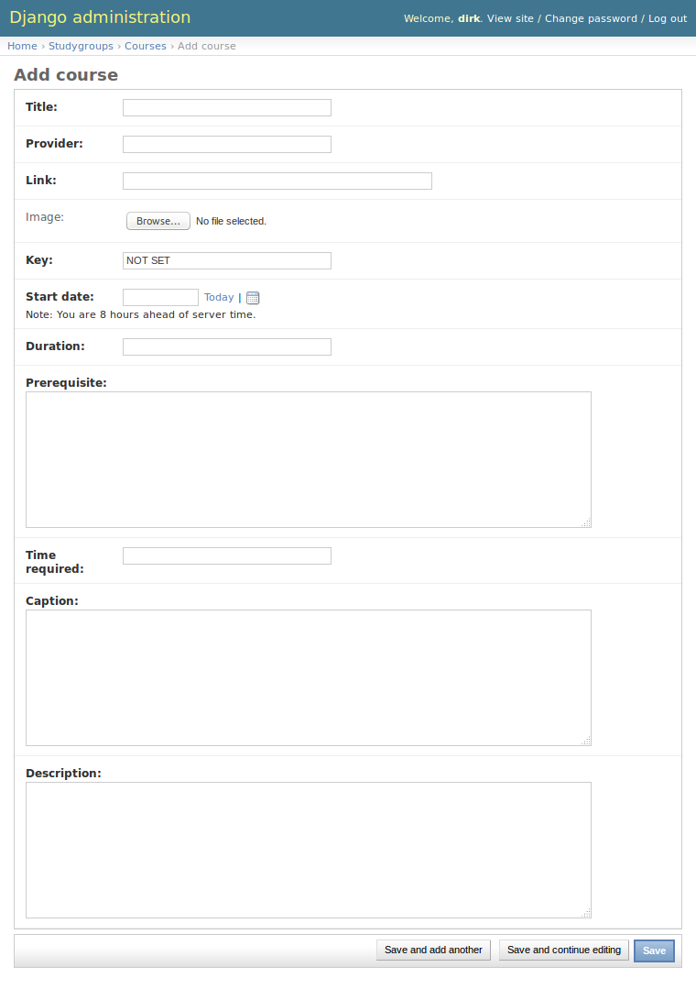
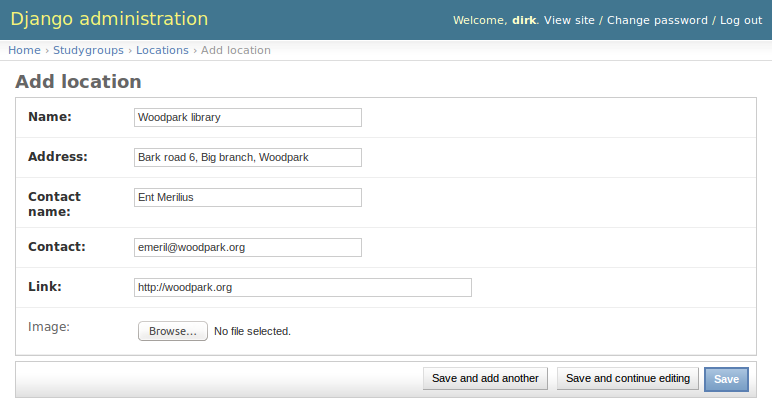
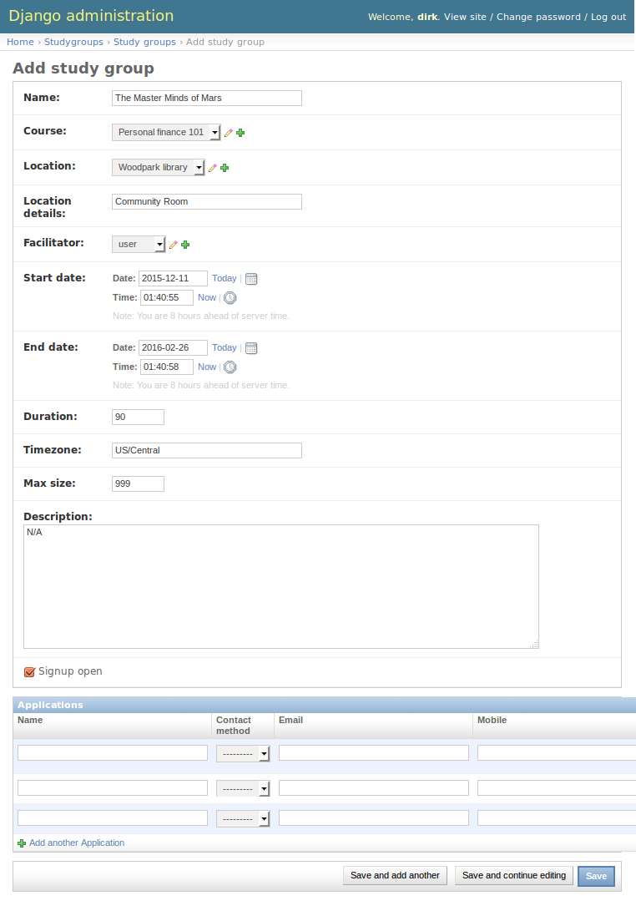

Organizer guide
===============

As an organizer it is your responsibility to add new facilitators, courses, locations and ultimately create learning circles.

Adding facilitators
-------------------

To add a facilitator you first need to create a user, to do so, go to http://example.com/en/admin/.

Click the add link next to "Users"

Fill in a username and password (we recommend using a random password and asking users to reset their password). Once done, click on "save and continue editing"

.. image:: _static/admin-user-add.png

Fill in the email address, first name and last name and click "Save" once done.

You will be redirect to a list of all users. Go back to the home admin screen by click on home. You can do so at any stage while navigating the admin interface.

Click on add next to Facilitators in the list on the home screen, select the user you just created and click "Save" once done.

Adding courses
--------------

Click on add next to Courses on the admin homepage, fill in the required data and click "Save" once done.

Adding locations
----------------

Click on add next to Locations on the admin homepage. Fill in the relevant fields and click save once done.

Creating learning circles
-------------------------

Click on add next to Study Group, fill in the relevant data and click save once done.

