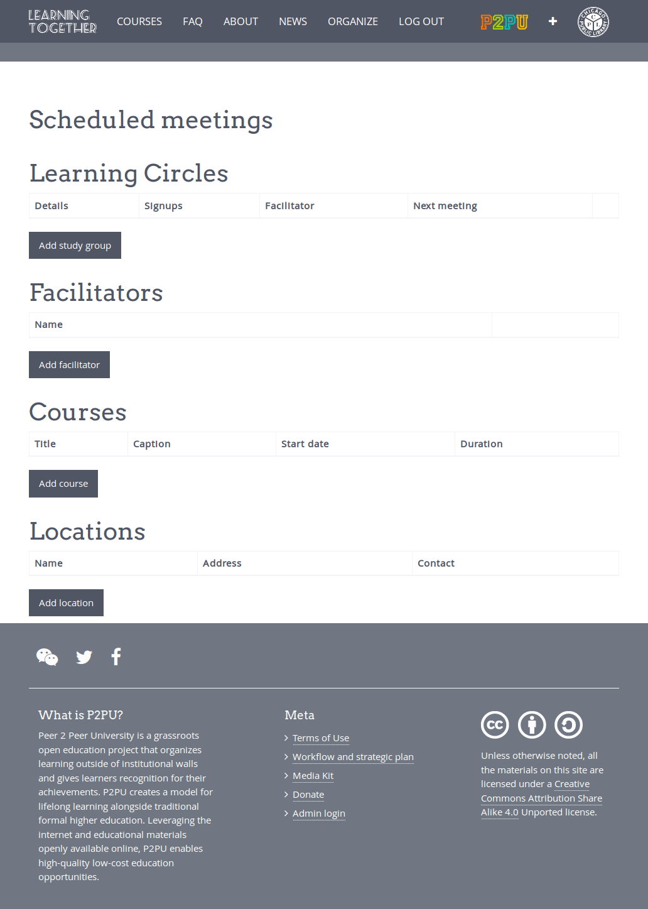
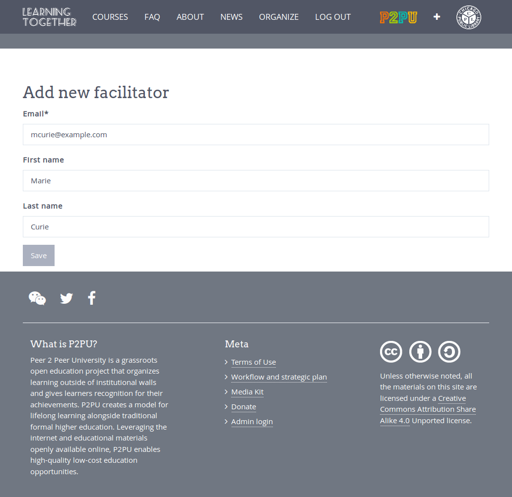
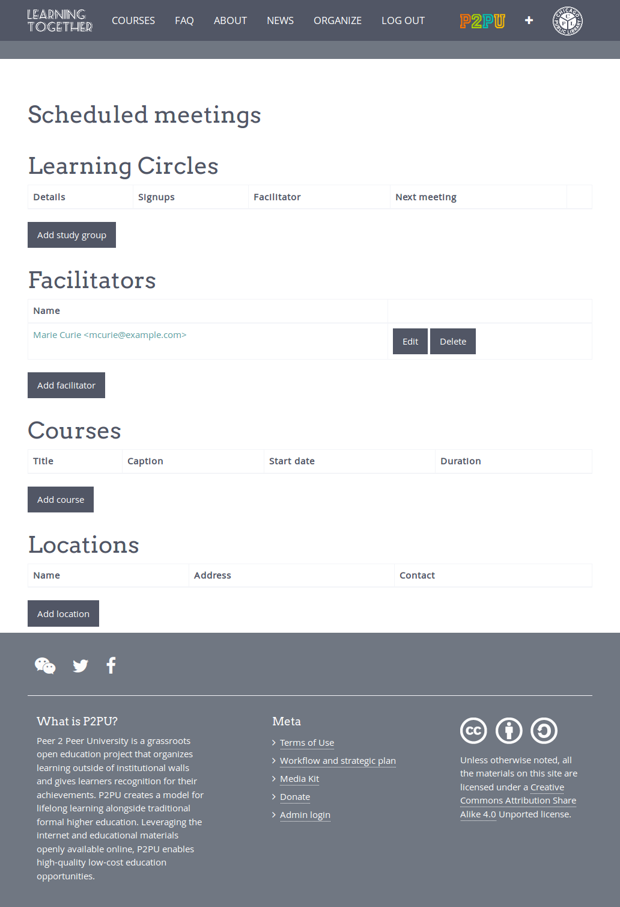
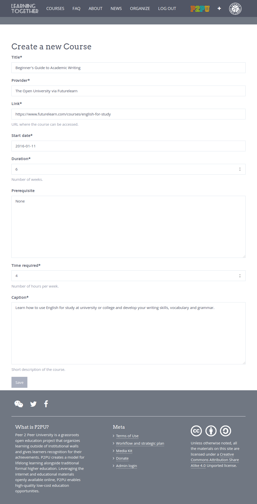
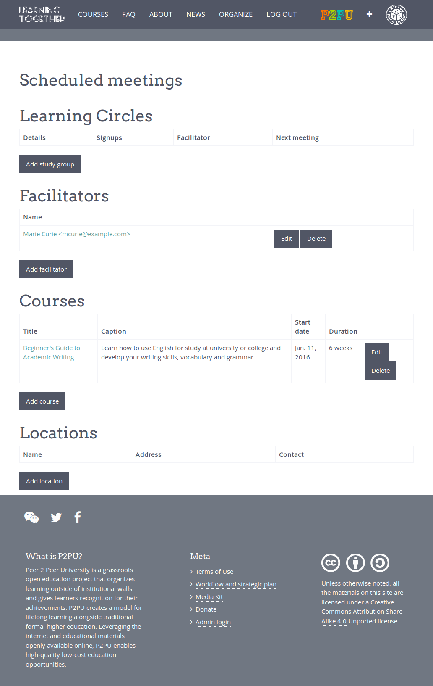
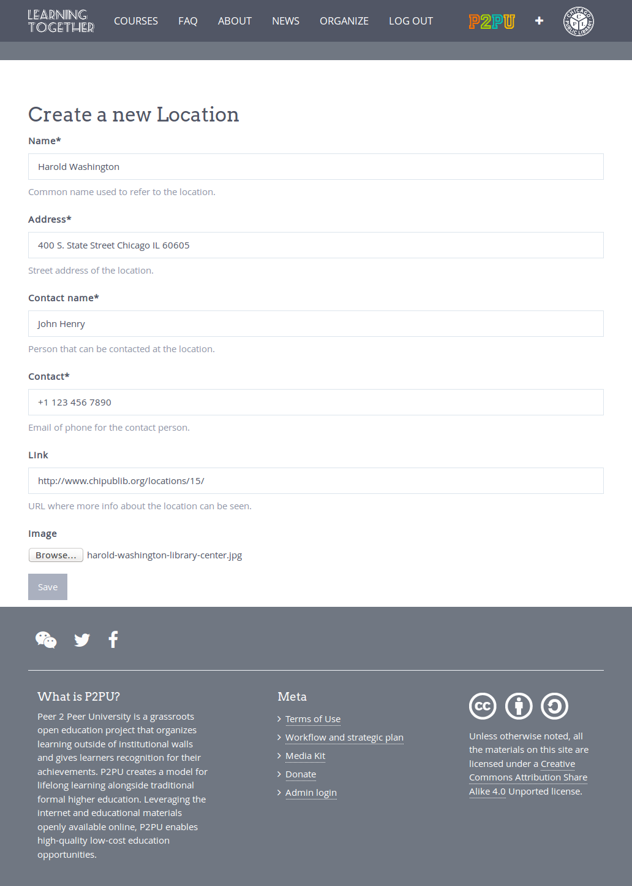
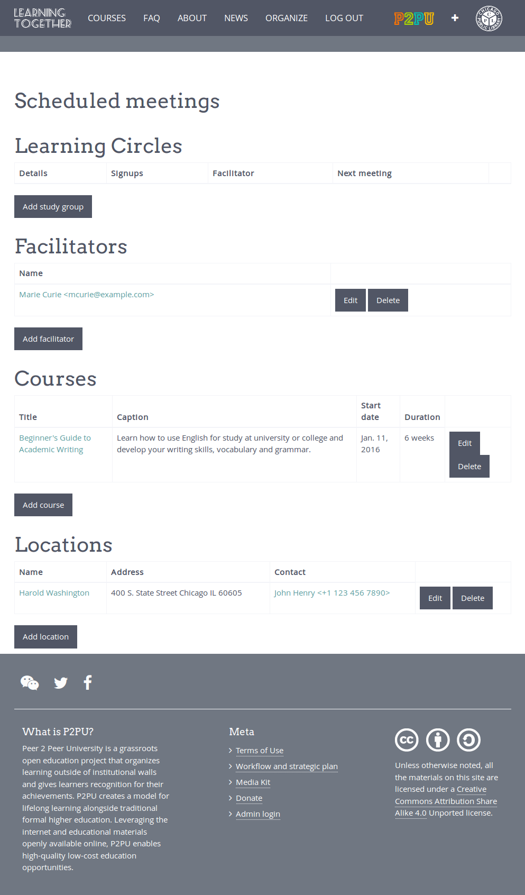
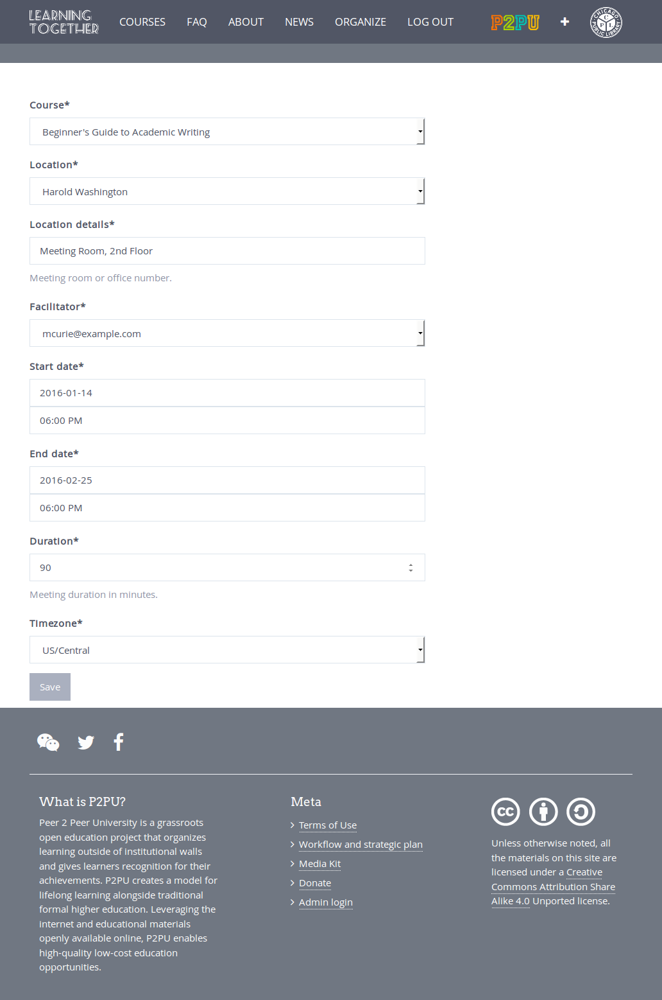
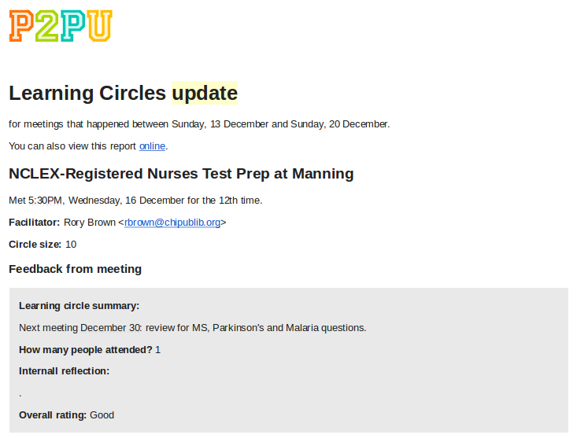

Organizer guide
===============

As an organizer it is your responsibility to add new facilitators, courses, locations and ultimately create learning circles. You can do all of this by loggin into the organizer dashboard. Go to http://example.com/en/organize/. If you are already logged in, you can simply follow the link at the top.

Adding facilitators
-------------------

To add a facilitator click on 'Add facilitator' and fill in the form and click 'Save'.

Facilitators will need to reset their password using the email above before they can log in. See the facilitator part of this manual for more details.

Adding courses
--------------

Click 'Add course', fill in the required data and click "Save" once done.

Adding locations
----------------

Click 'Add location' on the organizer dashboard, fill in the relevant fields and click save once done.

Creating learning circles
-------------------------

Click 'Add learning circle', fill in the relevant data and click save once done.

.. image:: _static/dash-learningcircle.png

Adding a new learning circle will also create the weekly meetings for the learning circle. A summary of learning circle meetings on a per week basis will be displayed on the organizer dashboard. For more information on managing weekly meetings, see the facilitator part of this guide.

Weekly update
-------------

As a facilitator you will also receive a weekly update of learning circle meetings that happened the previous week every Monday.

